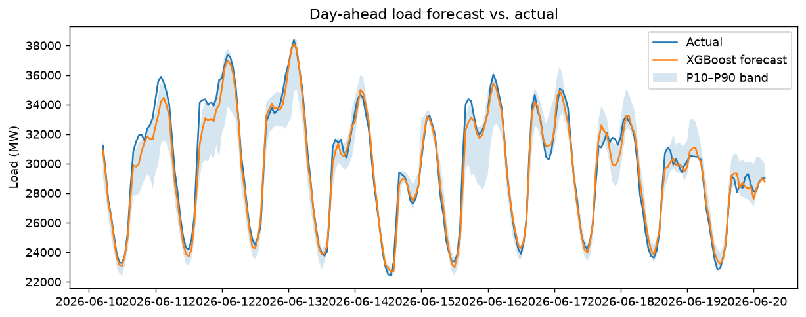
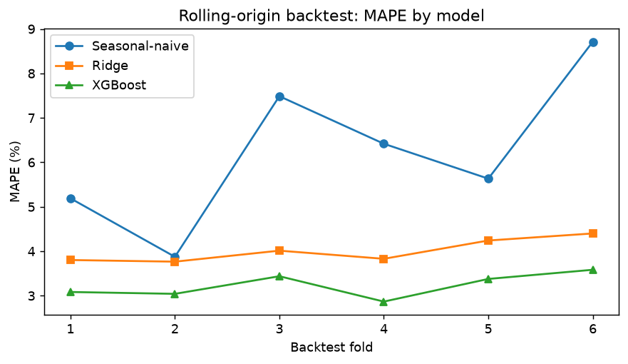
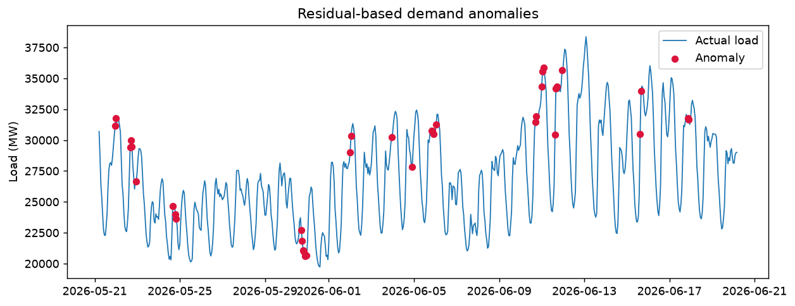

# ⚡ Day-Ahead Grid Load Forecasting (CAISO)

End-to-end machine-learning system that forecasts **day-ahead hourly electricity
demand** for a grid balancing authority (default: **CISO — California ISO**, the
region served by Southern California Edison), produces **P10–P90 uncertainty
bands**, flags demand **anomalies**, and serves predictions through a **REST API**
and an interactive **dashboard**.

Built to mirror the day-ahead load-forecasting and operational-monitoring work a
grid-operations data-science team does on weather-driven demand time series.

## Results

**Real CAISO (CISO) data** — ~2 years of hourly demand (19,808 hours) from the
EIA API joined to Open-Meteo temperature, 6-fold rolling-origin backtest:

| Model | MAPE | Notes |
|-------|------|-------|
| Seasonal-naive (same hour, prior week) | **6.22%** | baseline |
| Ridge regression | 4.01% | linear ML baseline |
| **XGBoost (weather-aware)** | **3.23%** (MAE 824 MW) | **~45% lower error than baseline** |

P10–P90 prediction band coverage: **81%** (well calibrated). 344 demand
anomalies flagged over the period.





## What it does

| Stage | Detail |
|-------|--------|
| **Ingest** | Hourly demand from EIA v2 (CAISO) + temperature from Open-Meteo, with a zero-setup synthetic fallback |
| **Feature engineering** | Calendar (cyclical hour/day/season, holidays), leak-safe lags & rolling stats, **weather** (temp, heating/cooling degrees) |
| **Models** | Seasonal-naive + Ridge baselines vs. **XGBoost**; plus P10/P90 **quantile** models for uncertainty bands |
| **Evaluation** | **Rolling-origin backtest** — MAPE / MAE and % lift over baseline, per fold |
| **Anomaly detection** | Residual-based, MAD-scaled robust z-score to flag abnormal demand hours |
| **Explainability** | **SHAP** global feature-importance ranking |
| **Serving** | **FastAPI** `/forecast` endpoint + **Streamlit** dashboard for technical & non-technical users |
| **Testing** | `pytest` suite covering data schema, leak-safe features, metrics, and anomaly logic |

## Architecture

```
weather.py ┐
data.py ───┴→ features.py ─→ models.py ─┬→ backtest.py ─→ metrics.json
                                        ├→ anomaly.py
                                        ├→ explain.py (SHAP)
                                        └→ report.py  (figures)
                                 train.py  (orchestrates, saves models)
                            api/main.py  +  dashboard/app.py  (serve)
                                 tests/   (pytest)
```

## Quickstart

```bash
pip install -r requirements.txt     # or: make install
# macOS only: brew install libomp   (XGBoost's OpenMP runtime)
python -m src.train                 # train + backtest + figures   (make train)
pytest -q                           # run the test suite           (make test)
uvicorn api.main:app --reload       # REST API at :8000/docs        (make api)
streamlit run dashboard/app.py      # dashboard at :8501            (make dashboard)
```

The pipeline runs immediately on a built-in, **weather-coupled synthetic** load
series. For real California grid data, get a free key at
<https://www.eia.gov/opendata/> (temperature comes from Open-Meteo, no key):

```bash
export EIA_API_KEY=your_key_here
export EIA_RESPONDENT=CISO          # any EIA balancing authority
make train
```

## Example API call

```bash
curl -X POST localhost:8000/forecast \
  -H 'Content-Type: application/json' \
  -d '{"history": [{"timestamp": "2026-01-01T00:00:00", "load_mw": 24000, "temp_c": 19}, ...]}'
# -> {"forecast_timestamp": "...", "forecast_mw": 25431.7}
```

## Notes

- No secrets in source — the EIA key is read from the environment.
- Lag and rolling features are shifted by the forecast horizon so the model
  never sees information unavailable at prediction time (verified by a test).
- Swap in any hourly CSV with `timestamp`, `load_mw` (+ optional `temp_c`)
  columns to forecast a different region or signal.
